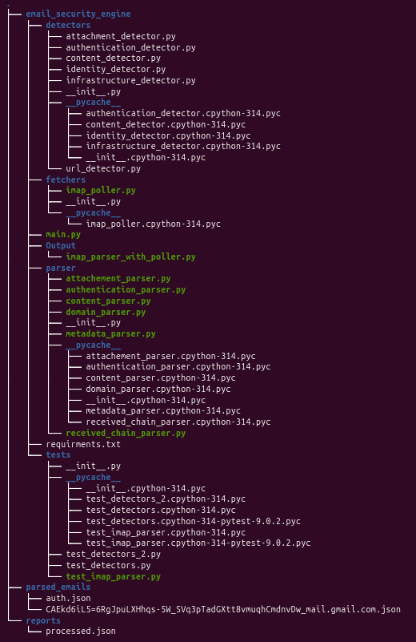

__init__.py file is empty in each folder.

email_security_engine(Main Folder)
- .pyvirtual is virtual env for windows and .venv is virtual env for linux.(Included in zip , not in image)
- detector contains dectector engine scripts.(I don't include url_detector and attachment in test_detector_2.py)
- fetcher contain file that fetch email from mail box and it is Outh2 ,so that every parser don't do it.
- output give output as json with result of parsed e-mail.
- parser contain all e-mail parsing script.
- tests contain test files 
- requirment.txt contains all packets need to install using (pip install -r requirment.txt)
**Here test_imap_parser.py use personal mail box and credentials .You can test it  by creating app password.** 
Use this syntax to run test file ***python -m email_security_engine.tests.test_detectors_2***
